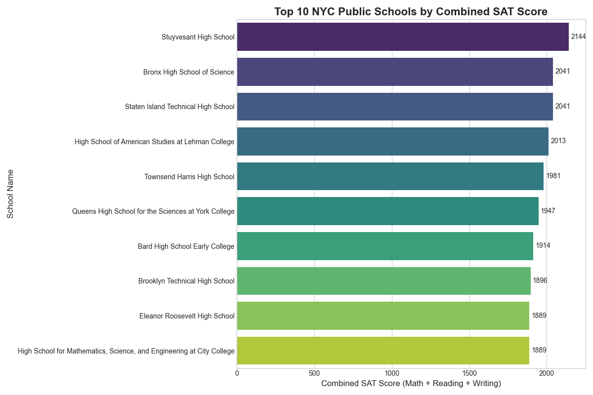
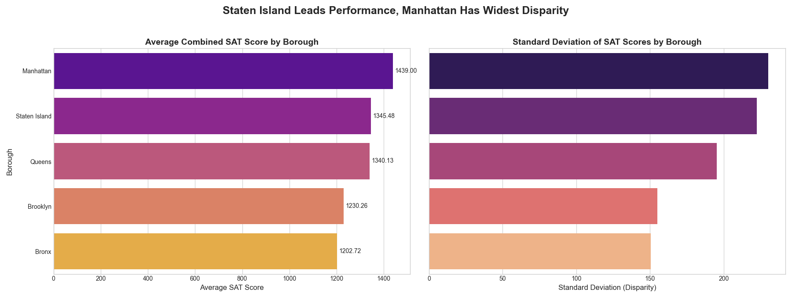

# Analysis of Educational Disparity in NYC Public Schools

## Project Overview

This project analyzes SAT performance data for New York City public high schools to identify key trends and disparities in student outcomes. The primary stakeholder for this analysis is a **policy analyst at the NYC Department of Education (DoE)**. The insights generated are intended to inform resource allocation, highlight models of academic excellence, and identify boroughs requiring targeted support to address educational inequality.

This project demonstrates a full-cycle data analysis workflow, moving from data cleaning and exploration to the generation of actionable, data-driven recommendations.

---

## Executive Summary & Key Findings

For a busy stakeholder, here are the essential takeaways:

*   **Elite Performance is Concentrated:** A small number of specialized high schools, led by Stuyvesant High School, significantly outperform others. These schools serve as a clear benchmark for academic excellence in the city.
*   **A Tale of Two Boroughs:**
    *   **Staten Island** boasts the **highest average SAT performance** (1439), suggesting a successful educational model at the borough level.
    *   **Manhattan** exhibits the **widest disparity** in performance, with the largest standard deviation (230.29). This indicates a significant gap between its top-tier schools and other institutions, highlighting the most pronounced inequality.
*   **Consistency in the Bronx & Brooklyn:** Contrary to what might be assumed, The Bronx and Brooklyn have the most consistent performance across their schools (lowest standard deviation), suggesting more equitable outcomes within those boroughs, albeit at a lower average performance level.

---

## Tools & Technologies

*   **Programming Language:** Python
*   **Libraries:** Pandas (for data manipulation), Matplotlib & Seaborn (for data visualization)
*   **Environment:** Jupyter Notebook

---

## Analysis Deep Dive & Visualizations

### Question 1: Which schools achieve the highest overall performance?

To identify top-tier institutions for a potential "Schools of Excellence" program, we identified the top 10 schools based on their combined average SAT scores (Math, Reading, and Writing).



**Insight:** The results are dominated by specialized and selective high schools. Stuyvesant High School is in a class of its own, reinforcing the impact of selective admissions on performance metrics.

### Question 2: Which boroughs show the highest performance and the widest disparity?

To understand borough-level dynamics, we analyzed both the average performance and the standard deviation of combined SAT scores.



**Insight:** The side-by-side comparison reveals a crucial narrative. Staten Island leads in average performance, making it a model for success. However, Manhattan's massive standard deviation highlights a critical challenge for the DoE: addressing the vast resource and performance gap within the borough.

---

## Data Cleaning & Preparation

The analysis was built on a foundation of clean, reliable data.

*   **Data Validation:** The dataset contains 375 school records. An initial check revealed **20 missing values** in the `percent_tested` column. As this column was not central to the primary stakeholder questions, the issue was documented and the analysis proceeded using the complete records for SAT scores to avoid data loss.
*   **Feature Engineering:** A new feature, `total_SAT`, was created by summing the average math, reading, and writing scores. This served as the primary North Star Metric for overall school performance.

---

## Strategic Recommendations & Future Work

Based on the analysis, I recommend the following actions for the NYC Department of Education:

1.  **Deconstruct Staten Island's Success:** Launch a study to understand the factors driving Staten Island's high average performance. Are there lessons in curriculum, funding, or teacher support that can be applied city-wide?
2.  **Address Manhattan's Disparity:** Prioritize a deep-dive investigation into the performance gap in Manhattan. This should analyze factors separating the highest and lowest-performing schools to inform targeted intervention strategies.
3.  **Learn from Consistency Models:** Analyze the educational strategies in The Bronx and Brooklyn that lead to more consistent outcomes, as these may hold the key to raising the floor for performance across the city.

---

## How to Run This Project

1.  Clone this repository to your local machine.
2.  Ensure you have Python and the required libraries installed. You can install them using the `requirements.txt` file:
    ```bash
    pip install -r requirements.txt
    ```
3.  Open and run the `nyc_sat_score_analysis.ipynb` Jupyter Notebook to see the full analysis.